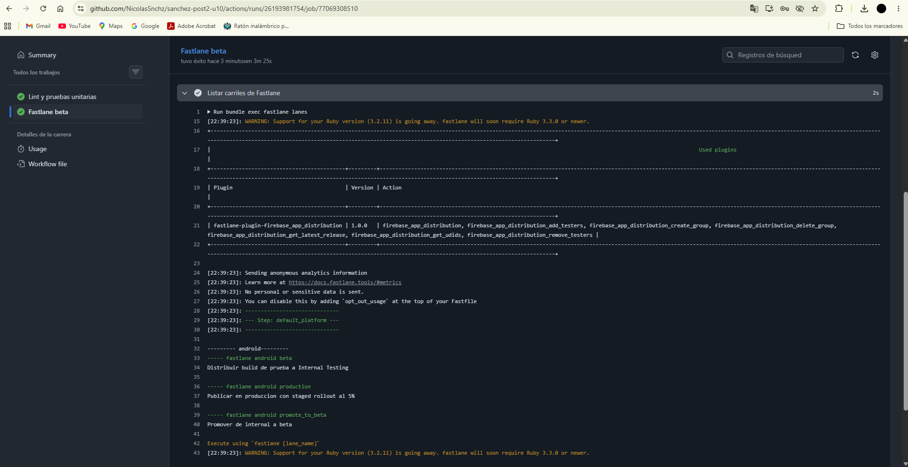
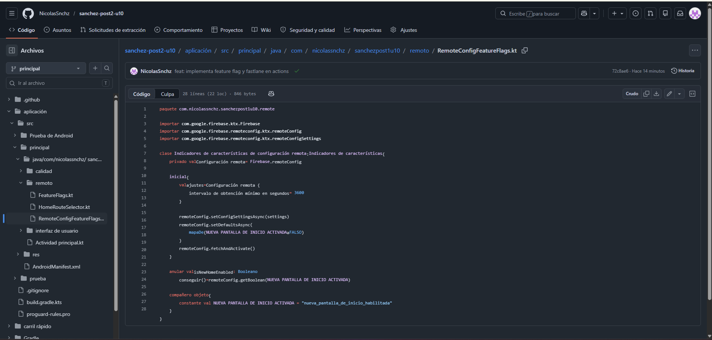
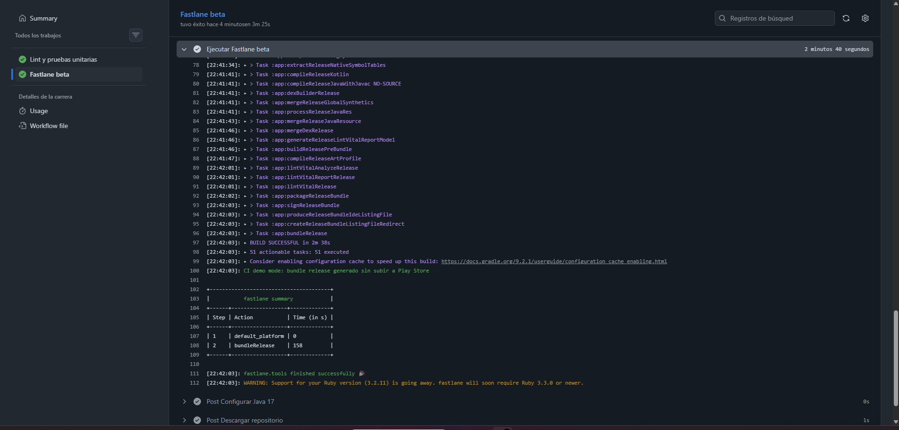

# sanchez-post2-u10

Proyecto Android para la actividad Unidad 10 - Post Contenido 2: Automatizacion de Publicacion con Fastlane.

## Objetivo

Configurar Fastlane para automatizar la publicacion Android, integrar el flujo en GitHub Actions, implementar un feature flag con Firebase Remote Config y documentar versionamiento con Conventional Commits.

## Flujo completo

Commit convencional -> GitHub Actions -> Lint y pruebas -> Fastlane beta -> Build Release AAB -> Play Store Internal Track -> Feature Flag con Firebase Remote Config.

## Fastlane

Archivos configurados:

- Gemfile
- fastlane/Appfile
- fastlane/Fastfile

Lanes implementadas:

- beta: genera build Release y prepara distribucion para Internal Testing.
- production: publica en produccion con staged rollout al 5%.
- promote_to_beta: promueve desde internal hacia beta.

Comandos principales:

- bundle exec fastlane lanes
- bundle exec fastlane beta
- bundle exec fastlane production
- bundle exec fastlane promote_to_beta

## GitHub Actions

Workflow principal:

.github/workflows/android-ci.yml

Jobs configurados:

- lint-test: ejecuta lintDebug, testDebugUnitTest y jacocoTestCoverageVerification.
- fastlane-beta: configura Java, Ruby, Bundler, Keystore temporal o secrets, lista lanes y ejecuta bundle exec fastlane beta.

## Secrets necesarios

- KEYSTORE_BASE64
- KEYSTORE_PASS
- KEY_ALIAS
- KEY_PASS
- PLAY_CREDENTIALS_BASE64

## Firebase Remote Config

Feature flag implementado:

- new_home_screen_enabled

Comportamiento:

- false: muestra LegacyHomeScreen.
- true: muestra NewHomeScreen.

Archivos principales:

- app/src/main/java/com/nicolassnchz/sanchezpost1u10/remote/RemoteConfigFeatureFlags.kt
- app/src/main/java/com/nicolassnchz/sanchezpost1u10/remote/HomeRouteSelector.kt
- app/src/main/java/com/nicolassnchz/sanchezpost1u10/MainActivity.kt

## Conventional Commits

Formato usado:

- chore: configuracion, estructura o mantenimiento.
- feat: nueva funcionalidad.
- fix: correccion de errores.
- docs: documentacion.

Impacto esperado:

- feat: incremento MINOR.
- fix: incremento PATCH.
- feat! o BREAKING CHANGE: incremento MAJOR.

## Evidencias de checkpoints

### Checkpoint 1 - Fastlane configurado

Fastlane lista correctamente las lanes beta, production y promote_to_beta.

### Checkpoint 2 - Feature Flag implementado

El feature flag new_home_screen_enabled esta implementado con Firebase Remote Config.

### Checkpoint 3 - Pipeline ejecutando Fastlane beta

GitHub Actions ejecuta correctamente bundle exec fastlane beta.

## Resultado

El repositorio contiene proyecto Android, directorio fastlane, workflow actualizado, feature flag implementado, commits convencionales y evidencias de los 3 checkpoints.
